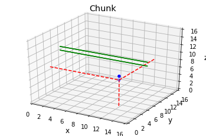

```python
# -*- coding: utf-8 -*-
"""
Created on Tue Apr 23 04:40:05 2019

@author: victo_000
"""

#Minecraft diamond strat

import numpy as np
import matplotlib.pyplot as plt
from mpl_toolkits.mplot3d import Axes3D
import time
```


```python
def progression(i,maxi,start_time):
    percent = i/maxi
    percent = int(percent / 0.01)
    
    percent_previt = (i-1)/maxi
    percent_previt = int(percent_previt / 0.01)
    
    if (percent % 10 == 0 and i != 0 and percent != percent_previt):

        tick = time.time() - start_time
        remaining = tick*(maxi/i - 1)
        if remaining > 60:
            print("{}% (remaining: {:.0f}m {:.2f}s)".format(int((i/maxi) *100), np.floor(tick*(maxi/i - 1) / 60), round(remaining - np.floor(tick*(maxi/i - 1) / 60)*60,2)))
        else:
            print("{}% (remaining: {:.2f}s)".format(int((i/maxi) *100),remaining))
            

```


```python
class Chunk:
    def __init__(self):
        self.grid = np.zeros((15,16,16)).astype(int)
        self.diams_init = np.random.poisson(4)#3.7
        while self.diams_init == 0:
            self.diams_init = np.random.poisson(4)
        
        self.diams = self.diams_init
        
        self.init_xy = np.floor(np.random.uniform(16,0,2)).astype(int)
        self.init_z = np.floor(np.random.uniform(15)).astype(int)
        
        self.err = 0
        
        while self.diams > 0 and self.err < 1_000:
            seed = np.random.poisson(0.5,3)*np.random.choice([1,-1],3)
            try:
                if self.diams == self.diams_init:
                    self.grid[self.init_z][self.init_xy[0]][self.init_xy[1]] = 1
                    self.diams -= 1
                    #print('generated diam at',[self.init_z],[self.init_xy[0]],[self.init_xy[1]])
                
                elif self.grid[self.init_z + seed[0]][self.init_xy[0] + seed[1]][self.init_xy[1] + seed[2]] == 0:
                                    
                    if (self.grid[self.init_z + seed[0]+1][self.init_xy[0] + seed[1]][self.init_xy[1] + seed[2]] == 1 or
                        self.grid[self.init_z + seed[0]-1][self.init_xy[0] + seed[1]][self.init_xy[1] + seed[2]] == 1 or
                        self.grid[self.init_z + seed[0]][self.init_xy[0] + seed[1]+1][self.init_xy[1] + seed[2]] == 1 or
                        self.grid[self.init_z + seed[0]][self.init_xy[0] + seed[1]-1][self.init_xy[1] + seed[2]] == 1 or
                        self.grid[self.init_z + seed[0]][self.init_xy[0] + seed[1]][self.init_xy[1] + seed[2]+1] == 1 or
                        self.grid[self.init_z + seed[0]][self.init_xy[0] + seed[1]][self.init_xy[1] + seed[2]-1] == 1):
                        
                            self.grid[self.init_z + seed[0]][self.init_xy[0] + seed[1]][self.init_xy[1] + seed[2]] = 1
                            self.diams -= 1
                            #print('generated diam at',[self.init_z + seed[0]],[self.init_xy[0] + seed[1]],[self.init_xy[1] + seed[2]])
                            
                else:
                    self.err += 1
                    
            except IndexError:
                pass
        
        if self.err >= 1_000:
            Chunk() #Fixed, now will try until it works
            #raise GenerationError("Could not Generate Diamonds properly")

    def show(self):
        z,x,y = self.grid.nonzero()
        coords = (z,x,y)
        
        for each in range(len(coords[0])):
            print("Point {}: (x = {}, y = {}, z = {})".format(each+1,coords[2][each],coords[1][each],coords[0][each]))
        
        fig = plt.figure()
        ax = fig.add_subplot(111, projection='3d')
        ax.scatter(x, y, z, zdir='z', c='blue')
        
        ax.plot([coords[1][0],coords[1][0]],[coords[2][0],coords[2][0]],[0,coords[0][0]],c='red',linestyle='dashed')
        ax.plot([0,coords[1][0]],[coords[2][0],coords[2][0]],[coords[0][0],coords[0][0]],c='red',linestyle='dashed')
        ax.plot([coords[1][0],coords[1][0]],[coords[2][0],16],[coords[0][0],coords[0][0]],c='red',linestyle='dashed')
        
        ax.plot([0,15],[8,8],[10,10],c='green')
        ax.plot([0,15],[8,8],[10,10],c='green')
        ax.plot([0,15],[8,8],[11,11],c='green')
        ax.plot([0,15],[8,8],[11,11],c='green')

        ax.set_xlim3d(0,16)
        ax.set_ylim3d(0,16)
        ax.set_zlim3d(0,16)
        
        ax.set_xlabel('x',fontsize='large')
        ax.set_ylabel('y',fontsize='large')
        ax.set_zlabel('z',fontsize='large')
        ax.set_title('Chunk',fontsize='x-large')

        plt.show()
        #plt.savefig("demo.png")
```


```python
if __name__ == '__main__':
    

    total_chunks = 100_000
    rand = 8 #Mining roughly in middle of chunk
    
    ##############################################################################
    ##############################################################################
    ##############################################################################
    
    fullplane = np.zeros((total_chunks))
    found_0 = 0
    found_1 = 0
    found_2 = 0
    found_3 = 0
    
    start = time.time()
    
    for i in range(total_chunks):
        
        progression(i,total_chunks,start)
        
        a = Chunk()
        fullplane[i] = a.grid[8:15].sum()
        
        
        #strat 0: 1x1
        tunel_0 = a.grid[10][rand]
        
        sides_0 = np.concatenate((a.grid[9][rand],   #Down
                                a.grid[11][rand],  #Up
                                a.grid[10][rand-1], #Footleft
                                a.grid[10][rand+1] #Footright
                                ))
        
        if 1 in sides_0 or 1 in tunel_0:
            found_0 += a.diams_init
        
        
        #strat 1: 2x1
        tunel_1 = np.concatenate((a.grid[10][rand],
                                a.grid[11][rand]))
        
        sides_1 = np.concatenate((a.grid[9][rand],   #Down
                                a.grid[12][rand],  #Up
                                a.grid[10][rand-1], #Footleft
                                a.grid[10][rand+1], #Footright
                                a.grid[11][rand-1], #Headleft
                                a.grid[11][rand+1] #Headright
                                ))
        
        if 1 in sides_1 or 1 in tunel_1:
            found_1 += a.diams_init
        
        
        #strat 2: 2x2
        tunel_2 = np.concatenate((a.grid[10][rand],
                                a.grid[11][rand],
                                a.grid[10][rand+1],
                                a.grid[11][rand+1]))
        
        sides_2 = np.concatenate((a.grid[9][rand],   #Down
                                a.grid[12][rand],  #Up
                                a.grid[10][rand-1], #Footleft
                                a.grid[11][rand-1], #Headleft
                                a.grid[9][rand+1],   #Down
                                a.grid[12][rand+1],  #Up
                                a.grid[10][rand+2], #Footright
                                a.grid[11][rand+2] #Headright
                                ))
        
        if 1 in sides_2 or 1 in tunel_2:
            found_2 += a.diams_init
    
        #strat 3: 2x3
        tunel_3 = np.concatenate((a.grid[10][rand],
                                a.grid[11][rand],
                                a.grid[12][rand],
                                a.grid[10][rand+1],
                                a.grid[11][rand+1],
                                a.grid[12][rand+1]))
        
        sides_3 = np.concatenate((a.grid[9][rand],   #Down
                                a.grid[13][rand],  #Up
                                
                                a.grid[10][rand-1], #Footleft
                                a.grid[11][rand-1], #Midleft
                                a.grid[12][rand-1],#Headleft
                                
                                a.grid[9][rand+1],   #Down
                                a.grid[12][rand+1],  #Up
                                
                                a.grid[10][rand+2], #Footright
                                a.grid[11][rand+2], #Midright
                                a.grid[12][rand+2] #Headright
                                ))
        
        if 1 in sides_3 or 1 in tunel_3:
            found_3 += a.diams_init
```

    10% (remaining: 50.01s)
    20% (remaining: 43.31s)
    30% (remaining: 37.49s)
    40% (remaining: 32.66s)
    50% (remaining: 27.11s)
    60% (remaining: 21.62s)
    70% (remaining: 16.19s)
    80% (remaining: 10.72s)
    90% (remaining: 5.36s)
    


```python
  
    foundl = [found_0,
              found_1,
              found_2,
              found_3]
    
    tunell = [tunel_0,
              tunel_1,
              tunel_2,
              tunel_3]
    
    kind = ['1x1',
            '2x1',
            '2x2',
            '3x2']
    
    for ii in range(len(tunell)):
        print("")
        print("Technique {}: \t\t\t\t{}".format(ii,kind[ii]))
        print("Total diams in layers 8-15 (7): \t{}".format(int(sum(fullplane))))
        print("Total diams found: \t\t\t{}".format(foundl[ii]))
        print("Chunk Findrate: \t\t\t{:.2f}%".format(foundl[ii]/sum(fullplane)*100))
        print("Efficiency (diam/bloc mined): \t\t{:.2f}%".format(((foundl[ii]/(total_chunks*len(tunell[ii])))*100)))


```

    
    Technique 0: 				1x1
    Total diams in layers 8-15 (7): 	204810
    Total diams found: 			20889
    Chunk Findrate: 			10.20%
    Efficiency (diam/bloc mined): 		1.31%
    
    Technique 1: 				2x1
    Total diams in layers 8-15 (7): 	204810
    Total diams found: 			30289
    Chunk Findrate: 			14.79%
    Efficiency (diam/bloc mined): 		0.95%
    
    Technique 2: 				2x2
    Total diams in layers 8-15 (7): 	204810
    Total diams found: 			40987
    Chunk Findrate: 			20.01%
    Efficiency (diam/bloc mined): 		0.64%
    
    Technique 3: 				3x2
    Total diams in layers 8-15 (7): 	204810
    Total diams found: 			51033
    Chunk Findrate: 			24.92%
    Efficiency (diam/bloc mined): 		0.53%
    


```python
### Examples

for i in range (3):
    print("\n"*3)
    print(format(" Example {} ".format(i+1),"=^36s"))
    a = Chunk()
    a.show()
```

    
    
    
    
    ============ Example 1 =============
    Point 1: (x = 11, y = 14, z = 6)
    Point 2: (x = 11, y = 13, z = 7)
    Point 3: (x = 10, y = 14, z = 7)
    Point 4: (x = 11, y = 14, z = 7)
    


    
    
    
    
    ============ Example 2 =============
    Point 1: (x = 5, y = 12, z = 7)
    Point 2: (x = 5, y = 12, z = 8)
    





    
    
    
    
    ============ Example 3 =============
    Point 1: (x = 15, y = 2, z = 9)
    Point 2: (x = 15, y = 1, z = 10)
    Point 3: (x = 15, y = 2, z = 10)
    


```python

```
